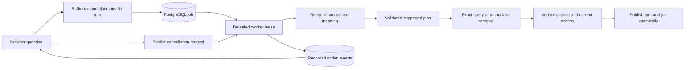

> **File use case:** Defines durable private conversation execution and visible activity.
> **What it does:** Records additive API, worker, recovery, security and operational contracts.

# Conversation jobs

Foundation A is verified locally and on the private VPS. See the
[acceptance record](verification-platform-foundation.md).
Migration 0013 extends existing private turns
with durable work; earlier synchronous turns remain readable. The control plane
stores job state, attempts, leases, ordered action events, bounded plans and result
references. Source data stays in existing storage and numerical results retain
ordinary calculation receipts.



## Public contract

All paths start with `/workspaces/{workspace_id}` and require the current Bearer
session. Jobs, events and turns are visible only to their owner with current
workspace/source access; a workspace administrator does not gain another person's
private conversation history.

| Request | Meaning |
| --- | --- |
| `POST /threads/{thread_id}/jobs` with `question`, UUID `request_id` | Submit one durable turn; return 202 and its job |
| `GET /jobs/{job_id}` | Current authorized job status |
| `GET /jobs/{job_id}/events?after=0` | Ordered recorded actions after the cursor |
| `POST /jobs/{job_id}/cancel` | Request cancellation; a queued job can stop immediately |
| `GET /jobs/{job_id}/result` | Resolve the terminal turn and verify its evidence; pending work returns 409 |

The existing synchronous `POST /threads/{thread_id}/ask` remains supported.
Submitting the same question/request identifier reopens the existing job; reusing
an identifier for another question is a conflict. One active request per private
thread preserves follow-up order. Job identifiers are additive in thread history.

The browser polls using authorization headers, never credentials in a URL. Closing
the page stops observation without claiming to cancel server work. Reopening the
private conversation reconnects to the same job. A network failure offers resume,
not an automatic submission with a different request ID. Cancellation remains a
request until the server reports a terminal state; completion can win that race.

## Progress and verification

Events have a sequence, timestamp, server-owned stage and status. Stages describe
actual actions: authorizing, checking source, interpreting, validating, querying,
retrieving documents, checking evidence and finishing. Events exclude model
reasoning, source values, questions, prompts and secrets. No fake percentages or
timer-driven stages appear. Reduced-motion settings disable decorative animation.

The supported plan is a small typed graph of profile inspection, one data query,
one document retrieval and evidence assembly. It records original source references
and a canonical checksum. It does not enable arbitrary SQL/code, new statistical
methods, guessed joins or model-chosen endpoints. Runtime execution retains the
existing domain validators and current permission/source checks.

Simple/Expert changes the presentation of the same answer and recorded actions.
Both preserve exact values, uncertainty, limitations, source distinctions and
access controls. Expert inspection does not rerun calculations. Loading a retained
result deliberately replays numerical evidence through the existing verification
path; one logical job is not a claim of exactly-once physical computation.

## Running the worker

After `make migrate`, run the API, web app and worker in separate terminals:

```bash
make api
make web
make jobs
```

The bounded command is:

```bash
python3 -m execplus.manage process-jobs --watch --concurrency 4 --poll-seconds 0.5
```

Without `--watch`, it processes one bounded batch. The queue is PostgreSQL-backed;
it does not depend on in-memory tasks in an API worker. Current defaults allow two
active jobs per workspace and 32 pending/active jobs per workspace. Lease duration
is 30 seconds; execution and publication have a 100-second deadline. Cancellation
is cooperative: joining a source reader or interrupted query during cleanup can
outlast that deadline. It is not a process kill guarantee. Settings are listed in
`.env.example`; operators can lower limits. Eight-user functional verification is
separate from sustained-load or production acceptance.

Each job permits at most three logical model invocations and seven actual provider
HTTP attempts, including retries. The current path is an optional helper, primary
planning and optional document-evidence selection. The adapter checks authorization,
cancellation and the attempt budget before each outgoing attempt. Input bytes bound
the selected tabular upload; documents retain their separate ingestion, passage and
selection limits. These counters are neither a token/currency billing quota nor an
OS-level memory/CPU guarantee. Query budgets and container limits remain separate.

Claims are fenced and workspace-serialized. A claim interrupted before execution
can be retried within the attempt bound. Once execution has started, lease loss
fails conservatively instead of silently running the question again. Late attempts
cannot publish results or activity. Retrying a failed request uses a new turn,
while prior failures and any query receipts remain available for audit.

The VPS `jobs` service uses the same API image, no new listening port and bounded
container resources. Backups pause API and job writers before object storage,
then restore only services that were running. The existing refresh/backup host lock
still coordinates staged refreshes. Stop workers during migrations or restore;
never roll back by deleting new turn/job metadata. Public identity and production
evaluation gates remain open.

The worker CLI catches unexpected startup, execution and disposal failures and
exits nonzero with a fixed failure code. It does not log exception text, SQL-bound
parameters or a traceback. SIGTERM cancels children and waits for their cleanup
before disposing the runtime. Operator provisioning retains its intentional token
output and must only be used through a private operator channel.
