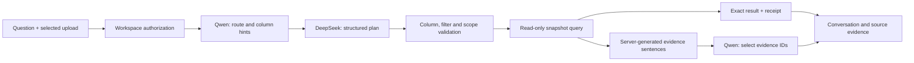

> **File use case:** Defines the interactive private-demo workspace and hybrid conversation contract.
> **What it does:** Documents supported journeys, provider roles, bounded results and verification.

# Conversational data explorer

The 2026-09-28 user request authorizes an interactive dashboard and conversational
exploration of uploaded data. DeepSeek V4 Pro is the primary planner; the private
Qwen3-4B endpoint assists with route/column selection and evidence selection.
This extends the private demo. It does not clear production gates or start the
broader Phase 4 connector, drill-across or forecasting scope.

## User journey

Sign in at `/workspace`. Existing data opens automatically. **Add data** opens the
data library; uploading without selecting a dataset creates one from the filename.
CSV and single-sheet XLSX retain the existing 20 MiB and parser limits. TXT and
Markdown supporting documents remain in **Documents**. PDF, arbitrary files and
external databases are not supported by this upload flow.

The overview combines calculated KPI cards, keyboard-accessible chart points,
clickable breakdowns, profile-based observations, a column diagram and a conversation.
The column diagram sends a question about a selected field. Motion respects the
browser's reduced-motion preference. Preparation, documents, saved work and team
controls have separate navigation entries. Source-row counts refer to the retained
upload; calculation evidence identifies the active revision.

Chat retains paired questions and responses while navigating the current upload.
Follow-ups use the previous execution's structured filters and grouping. Switching
the upload or applying a revision starts a fresh conversation. Refreshing the page
requires signing in again; sessions are not saved in browser storage. Historical
threads remain private in the API, but a history-picker UI is not implemented.

Try **Try cities sample** for fictional Karachi, Lahore and Islamabad records:

- `Show all records of Karachi`
- `Their total revenue?`
- `What is revenue by city?`
- `Show the first 10 records`
- `What can I ask about this data?`

The versioned `cities-v1` generator contains 24 fictional rows. Karachi has eight
rows with exact total revenue `11502.00`; all-city revenue is `37506.00`.
Existing sample versions and frozen profile reconstruction are unchanged.

## Model and execution boundaries



No provider names are branched on in routes or application services. Bootstrap
composes two implementations of the existing `LanguageModel` port. Primary
planning uses `ModelTier.LARGE`; selection uses `ModelTier.SMALL`.

Qwen receives schema metadata, the question and structured prior context. It
suggests a route and allowlisted columns; DeepSeek receives the full schema as
well and can correct that hint. Invalid or unavailable helper responses fall back
to primary planning. The helper has a 20-second timeout and no retry. Query plans
never contain model-generated SQL. Neither planner receives uploaded row bodies.
Question/filter text and schema labels may still contain sensitive information;
the hosted-provider production review remains required.

Summary selection uses short evidence IDs. Every displayed summary sentence is
generated by the server from executed values. Invalid evidence selections fail
closed. Dataset guidance is also server-rendered; model-proposed prose is ignored.

Configure the primary using the existing `EXECPLUS_LLM_*` settings. The optional
helper requires both:

```dotenv
EXECPLUS_LLM_SELECTION_BASE_URL=http://127.0.0.1:11450/v1
EXECPLUS_LLM_SELECTION_MODEL=qwen3:4b
EXECPLUS_LLM_SELECTION_API_KEY=
```

Leave both URL and model empty to use primary-only planning and selection. Helper
credentials are separate, private settings and are never sent to the browser.

## Additive API changes

Both upload `/ask` and thread `/ask` now accept model-classified `rows` and
`overview` intents. A record proposal has only `columns`, `filters` and `limit`.
Columns default to all authorized columns. Limits are 1–1000, default 100; the
runtime query limit may reduce this further. Unsupported fields and malformed
limits are rejected. `ieq` is an additive, parameter-bound, case-insensitive text
equality filter. Numeric/date/boolean comparisons preserve their prior semantics.

Row responses add `matched_records`, computed by a count against the same loaded
snapshot before applying the result limit. `records_analyzed` retains its original
meaning: source rows examined. The browser pages returned rows ten at a time and
explicitly reports truncation; it does not pretend a bounded result contains every
match. Narrower filters are required beyond the bound. Server-side offset/cursor
pagination and downloadable record exports remain future work.

Receipt checksums keep their existing encoding for historical replay compatibility.
New row receipts additionally retain and verify `matched_records`. Individual row
values remain out of receipt storage. Exact decimals and large integers retain
their string wire representation.

Migration `0008` extends allowed thread kinds and adds `model_route`. It preserves
existing turns. Downgrade maps overview to textual and rows to numerical while
retaining their messages and query references; it drops the added route column.
Readiness requires the current migration.

## Verification

`test_conversational_explorer.py` exercises malformed plans, hybrid fallback,
tenant denial before model calls, exact filtered values, replay, text-only files,
SQL injection parameters and guided/follow-up threads. Existing browser journeys
cover invitations, uploads, cleaning, saving, citations and feedback through the
new navigation. The new explorer browser case covers automatic dataset creation,
column diagrams, keyboard chart exploration, drill-down and reduced motion.

See the verification record for executed commands, results and live-provider limits.
