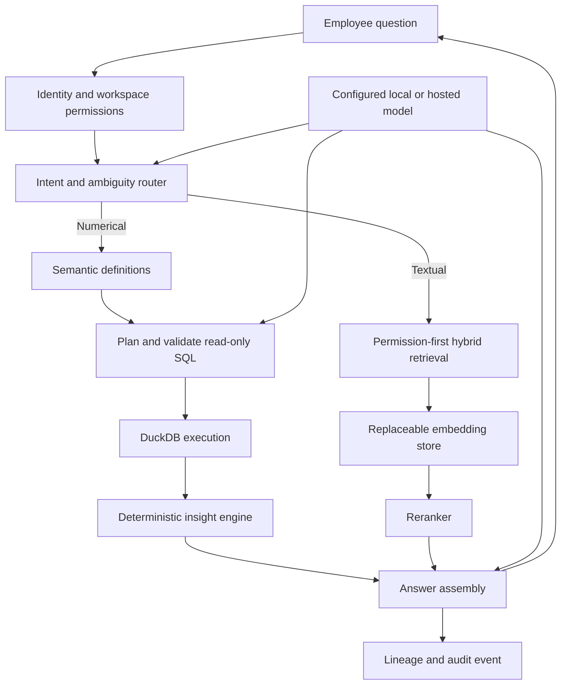

> **File use case:** Technical source of truth for ExecPlus system structure and request flows.
> **What it does:** Converts the product definition and reference diagram into enforceable components, boundaries, and data paths.

# ExecPlus Architecture

## Architectural style

ExecPlus begins as a modular monolith with independently testable modules and explicit infrastructure ports. This preserves transaction simplicity and delivery speed while allowing workers or high-load compute paths to be extracted when measurements justify it.

The deployable units are:

- `apps/web`: browser-facing Next.js application.
- `apps/api`: FastAPI control plane, durable conversation submission and compatible synchronous request orchestration.
- Conversation worker: PostgreSQL-backed private jobs, fenced attempts, cancellation and recorded activity; Foundation A is verified locally and deployed to the private demo.
- Bounded operator worker: scheduled staged-file activation, observation queries and in-app alerts. Asynchronous ingestion/export responsibilities remain future work.
- PostgreSQL: identity references, workspaces, permissions, metadata, threads, lineage, private forecasts/comparisons and audit records.
- Object storage: original uploads, documents and retained derived snapshots. Generated exports remain planned.
- DuckDB: exact analytical execution over a workspace-authorized dataset snapshot.
- Configurable models: local or hosted language-model providers behind one port.
- Configurable retrieval: an optional embedding store behind one port; no vendor is selected in Phase 0.

## Trust boundary

All application data, model endpoints, query execution, logs, and retrieval stores belong inside the configured customer or managed-cloud environment. A hosted model can be enabled only by explicit deployment configuration and must receive the minimum required schema or authorized passages. Raw datasets are not sent to a model.

## Query flow

Slice 3B implements bounded combined orchestration: one validated data query plus
one authorized document search. The diagram includes optional learned retrieval
components; bootstrap still uses the reference ranker. Slice 3C rejected the tested
learned candidate and did not adopt persistent Parquet serving or caches.

Models may propose an intent, query plan or supported presentation choice. The
execution adapter supplies source actuals; deterministic domain methods calculate
explicitly labelled forecast estimates and errors from those actuals. Models never
calculate either. Answer assembly retains the executed evidence and separates
observed values from statistical estimates.

## Module boundaries

| Module | Owns | Must not own |
| --- | --- | --- |
| Domain | Entities, value objects, invariants, errors | HTTP, database, model, or vendor SDKs |
| Application | Use-case orchestration and provider protocols | Framework request objects or concrete vendors |
| Presentation | HTTP transport, validation, status mapping | Business computation or persistence logic |
| Infrastructure | Database, object storage, query, model, and retrieval adapters | Product policy |
| Web | User interaction and server-side composition | Trusted numerical computation |

## Tenant isolation

Every tenant-owned aggregate carries `workspace_id`. Authorization creates a request scope containing the actor, workspace, role, and permitted dataset identifiers. Repositories require that scope rather than accepting an unscoped record identifier. PostgreSQL row-level security will be defense in depth; it does not replace application-level authorization.

Object keys follow a workspace prefix. Analytical files are opened only after the dataset has been authorized. Retrieval filters are applied before semantic search and repeated after retrieval. Audit records retain workspace and actor identifiers.

## Exact computation boundary

The query pipeline has discrete states: interpreted, needs clarification, validated, executed, refused, and failed. SQL must parse as a single read-only statement and reference only an allowlisted logical dataset view. Execution has row, memory, and time limits. The answer assembler consumes typed result cells plus lineage rather than arbitrary model-generated figures.

## Model routing

`EXECPLUS_LLM_MODE` selects `disabled`, `local`, or `hosted`. Both active routes use an OpenAI-compatible protocol, avoiding SDK coupling. The private explorer composes DeepSeek primary planning and optional Qwen route/column/evidence selection at bootstrap. Summary wording and numerical claims remain grounded in server-generated evidence. Secrets and endpoints enter only through environment configuration. An offline advisory judge trial in slice 3D failed adoption criteria; no judge is enabled in runtime. Human label review and the final assessment are complete; the measured outcome remains do not adopt.

## Vector readiness

The `EmbeddingStore` application protocol captures the stable capability needed by ExecPlus: upsert workspace-scoped chunks, permission-filtered search, and deletion by dataset. Vendor-specific collection names, filter syntax, indexes, and SDK types remain inside future infrastructure adapters.

A production vendor will be selected only after evaluation of metadata filtering, multitenancy, hybrid search, local hosting, managed hosting, backup and restore, operational complexity, latency, and total cost. The initial Phase 3 reference ranker is not that selection; the mandatory production evidence was deferred to Phase 5. Slice 3C adds candidate evaluation without clearing that gate.

## Observability and privacy

Logs use request, workspace, actor, dataset, thread, query, and model-run identifiers. They exclude uploaded row values, prompts containing source passages, secrets, and access tokens by default. Audits, receipts and bounded job events provide current operational evidence. Complete metrics coverage for request latency, ingestion outcomes, clarification/refusal rates, model usage and verification failures remains planned operational work; this paragraph does not claim that a metrics/tracing backend is deployed.

## October 4 platform foundation

The [audited plan](../platform-foundation-plan.md) extends existing aggregates instead
of replacing them. Artifact descriptors project uploads, revisions, profiles,
quality reports, documents, definitions, executions and study versions. Per-node
authorization applies to bounded lineage traversal; metadata availability never
claims that source bytes were verified. No physical storage pointer is exposed.

The [compute broker](../compute-broker.md) preserves QueryExecutor while registering
only the current DuckDB engine at bootstrap. Input/output limits, declared join
permissions, memory/threads/time and disabled temporary disk spill remain bounded.
Engine selection is not a model or browser decision. No remote engine or arbitrary
Python runtime is introduced.

Migration 0013 adds [durable conversation jobs](../conversation-jobs.md) over the
existing turn claim. A separate worker executes the same governed application
services, publishes only under a current lease and exposes real action events.
Legacy turns and receipts remain compatible. Typed plans describe existing
supported operations; statistics, ML, sandboxed code, extra parsers and broader
connectors retain their separately gated roadmap slices.

[ADR 0008](0008-durable-analysis-foundations.md) records the reuse, recovery and
operational tradeoffs. [Release evidence](../verification-platform-foundation.md)
separates functional acceptance from remaining production and advanced-method work.

## Phase 2 and Phase 3 implementation update (2026-09-17)

DuckDB now executes validated snapshot queries with exact decimal handling and
replayable receipts. See [ADR 0005](0005-verified-execution.md). Thread turns are
workspace-scoped and conversations owner-private. Saved analyses retain original
revision evidence; shared links require current membership.

Phase 3 activation services derive observations, comparison commentary and usage
from profiles/executions/events. Report delivery is an explicit operator command
with durable slot claims and authorization immediately before SMTP. Documents have
private/shared metadata, scoped object bytes and immutable passage offsets. A
reference hybrid ranker receives only authorized candidates; provider selection
remains deferred under [ADR 0006](0006-retrieval-evaluation.md).

## Conversational explorer (2026-09-28)

The interactive workspace uses server profiles, immutable revision evidence and
validated query results for its cards, chart drill-downs and conversational tables.
Bootstrap may compose a separate small-model selector alongside the primary planner.
Selection supplies advisory route/column hints; the primary retains the full schema
and the domain validates its proposed metric or record plan. Both adapters implement
the existing model protocol. See [the contract](../conversational-explorer.md).

Record queries compute a matching count on the same loaded snapshot independently
of their result limit. This is additive to the historical source-row count and does
not change existing result-checksum serialization. New receipts retain matching
counts and verify them on replay. Migration 0008 records the added conversation kinds
and composed model route without replacing earlier turns.

## Data-partner delivery boundaries

The revised [roadmap](../../ROADMAP.md) is authoritative for scope, order and
acceptance. Slices 3A–3B and catalog discovery are implemented; 3C–3D candidate
assessments are complete with no runtime optimization/judge adoption. Phase 4A
studies and adaptive dashboards, 4B refresh/monitoring and 4C basic forecasting are
implemented for the private demo. Searchable authorized audit history was brought
forward from 4D; 4D exports and 4E connectors remain planned. No production vector
vendor is selected, and all eight production gates remain blocked.

| Responsibility | Boundary | Phase |
| --- | --- | --- |
| Business understanding | Workspace-scoped, versioned meanings, goals, units, grain, metric definitions and reviewed relationships; explicit inferred/confirmed/rejected/needs-review state | 3A |
| Conversation orchestration | Authorized, bounded query/retrieval steps with structured context, clarification, source freshness and evidence assembly | 3B |
| Analytical representation | Immutable typed snapshots evaluated with DuckDB; originals and historical reconstruction remain available | 3C |
| Evidence discovery | Permission-filtered catalog and lexical/learned search candidates behind existing ports; embeddings locate evidence, not business totals | 3C |
| Advisory review | Offline/shadow checks against labeled cases; no authority over permissions, arithmetic or release approval | 3D |
| Studies and observations | Versioned questions, methods and results; bounded recomputation after an accepted refresh | 4A–4C |
| Basic forecasts | Governed calendar actuals, separate validation/test windows, immutable estimates and explicit later-actual comparisons | 4C |
| Evidence export | Permission-checked renderers over authorized executed results and saved study versions | 4D |
| Source adapters | Discovery, read-only extraction, checkpoints and lifecycle through provider-neutral ports; initial Sheets/PostgreSQL integrations | 4E |

An interpretation stores provenance and its source/definition versions. User
corrections must not be silently replaced by model suggestions. Source changes
trigger revalidation; ambiguous grain, currency or relationship cardinality must
not yield an apparently verified total. Private user preferences and shared
workspace definitions require distinct authorization rules.

Retained source bytes, analytical snapshots, document indexes and statistical
features serve different purposes. Derived artifacts carry source and method
versions and current access scope. Revoke access before retrieval/query/cache use;
deletion and rebuild contracts must cover derived representations. Versioned
receipts preserve replay where authorized sources are retained; deleted or
unavailable sources must produce an explicit limitation. A stale cache or
embedding is never substitute source data.

Connectors import approved data into the same governed snapshot flow. A customer's
read-only PostgreSQL source is distinct from ExecPlus's control-plane PostgreSQL.
Infrastructure adapters own provider SDKs, credentials and network validation;
domain/application modules retain their existing dependency direction. The model
never chooses arbitrary endpoints or writes to source systems. Schema drift,
partial refresh and disconnect retain explicit, tested states.

Adaptive views use approved components and supported methods selected from data
meaning and user goals; no untrusted generated UI code runs in the browser. New
research methods, extraction formats and advanced models require their own
acceptance evidence. Phase 5 remains the production gate for the complete deployed
combination, including the original eight mandatory release checks.

## Business understanding (2026-09-30)

The domain `understanding` module infers and validates bounded definitions without
framework or provider dependencies. `UnderstandingService` authorizes shared
versions separately from per-user preferences. Migration 0009 stores immutable
definitions and private goals; workspace locking and expected revision/version
checks reject competing edits.

Analytics reconstructs the source first, then applies confirmed column roles,
metric filters and units. A saved definition from a different revision requires
review. The planner receives these definitions as untrusted data and execution
checks the source/definition pair again after planning. Receipt sources retain
the immutable understanding ID so replay remains independent of later edits.
Relationship review precedes joins; executor cardinality checks prevent either
side's measures from being duplicated. See [the public contract](../phase3-data-understanding.md).

## Unified evidence and catalog (2026-09-30)

Migration 0010 adds durable private turn claims, retry IDs and evidence references.
The orchestrator bounds planning/retrieval and returns explicit partial failures.
Models select passage IDs; the server supplies checked source quotes and exact
executed numbers. Historical answers reauthorize source bytes and immutable receipts.
Catalog discovery builds a current permission-filtered metadata index per request.
See [the contracts](../phase3-unified-conversation.md).

Offline Parquet, learned retrieval and judge trials are separate from runtime
composition. The judge accepts only canonical synthetic fixture IDs, exposes no
product endpoint and cannot consume private runtime history. Its human-reviewed
assessment is complete with a do-not-adopt decision; no judge is enabled. See [ADR 0007](0007-representation-and-judge-trials.md).

## Adaptive studies and collaboration (2026-09-30)

`domain.studies` validates supported descriptive methods and selects deterministic
components from confirmed meaning, domain and private goal relevance. StudyService
composes the existing isolated executor and replay verifier. Each immutable study
version keeps method/source/definition/preparation evidence; rereads reauthorize
both the saved study and its original datasets. New snapshot runs create new
versions. Count queries use bound parameters and the existing narrow read-only SQL
grammar; no model supplies observations or business numbers.

Migration 0011 adds studies/versions, private recommendation dismissals, six-pin
boards and organization/department metadata. Workspace row locks serialize version,
sharing and pin mutations. PostgreSQL additionally constrains pin counts and tenant
references. An organization groups independently permissioned workspaces; it never
extends membership. Shared boards can include only explicitly shared studies and
reauthorize pins at read time. See [the contracts](../phase4-studies.md).

## Staged refresh and monitoring (4B)

Migration 0012 adds tenant-constrained feeds, candidates, immutable monitor methods,
observation job claims and private alert records. Object storage retains input deltas
and complete derived snapshots; PostgreSQL retains source pointers, methods and
receipt IDs. Activating a checked candidate atomically advances the source/meaning
head and enqueues at most six observations. Profile-v1 and old receipts are unchanged.

Analytics can reconstruct an explicitly captured historical source/definition for
worker jobs. Each query retains the existing numerical receipt contract. Observation
opening replays queries under current membership. Additive segment differences
reconcile to the scalar difference; narrative causality is never inferred.

The worker is an operator command composed from the same application services;
routes contain no provider selection. Database claims and unique constraints make
overlapping workers safe. Alert delivery and job completion commit together, after
current authorization, definition, freshness and coverage checks. Notifications are
in-app and private to the subscribing member. The VPS systemd timer and backup share
a host maintenance lock. No new listening port, external email or source connector
is added. See [the refresh contract](../phase4-refresh-monitoring.md).

## Basic forecasts and authorized audit history (2026-10-06)

Migration **0014** adds immutable private forecast runs and comparisons to the
existing control plane. Composite foreign keys bind workspace, dataset, upload,
revision and confirmed meaning; comparisons also retain their forecast owner.
Existing 0013 jobs, receipts and profile-v1/v2 reconstruction remain intact. The
current application requires 0014; rollback must preserve its new metadata.

`ForecastService` reuses authorized snapshot reconstruction, the compute broker and
execution receipts. Three bounded calendar queries calculate each period's measure,
present-value count and record count. Coverage is explicitly declared; daily or
whole-month boundaries, missing dates, missing measures and duplicate evidence
periods are validated. Missing history is never imputed as zero. Source reads and
parsing run off the event loop, cancellation waits for reader cleanup, and current
permissions/source meaning are checked again before publication.

The standard-library `domain.forecasting` module compares last-value, recent-mean,
linear-trend and eligible declared seasonal baselines. A chronological validation
window selects the method; a separate test window measures MAE, RMSE, WAPE and MAPE
and compares a last-value benchmark. Actuals retain exact decimal values. Estimates
and summary error metrics are rounded to eighteen significant digits; zero-value
percentage limitations are explicit. RMSE-based ranges are heuristic, not calibrated
confidence intervals or guaranteed coverage. The ARIMA/Prophet trial remains
isolated research and adds no runtime dependency or model call.

Reopening reconstructs the saved forecast from its original evidence. The three
distinct receipt IDs must match the expected SQL, typed parameters, source, actor,
dataset and result checksums. Method/version and saved results are verified too.
An explicit comparison can use an accepted refresh in the same dataset while
preserving metric, aggregation, filters, frequency and meaning. Unobserved periods
remain pending; the original forecast is never silently retrained or rewritten.
Commentary is rendered from these results, with measured differences separated
from causal explanations. See [forecast contracts and research](../phase4-forecasting.md)
and [release evidence](../verification-phase4c.md).

The additive audit-history API applies current membership, own-event visibility
and explicit shared-action/resource rules in SQL before bounded pagination. An
admin role does not expose another person's private conversation, forecast, query,
report or preference events. Search covers action/type/identifiers, not source
values, names or prompts. Unsharing changes the next read's visibility. This is
an operational history view, not tamper-evident retention or production security
acceptance. See [the visibility contract](../audit-history.md).

The browser's analysis focus chooses descriptive, basic predictive or all-supported
views; prescriptive analysis remains unavailable. The fictional forecasting sample
is additive. Forecast requests use explicit forms, not arbitrary predictive chat
execution. Phase 4D exports, 4E connectors and frozen Phase 6 advanced methods remain
separate work.

## Internal operations and product reporting (2026-10-06)

Migration 0015 adds revocable staff grants, staff audit, private support tickets and
immutable ticket events. Staff roles are independent of workspace membership and
never bypass existing source, conversation or numerical-evidence permissions.
The operations service exposes bounded metadata projections and purpose-specific
support conversations. Ticket writes check expected versions and serialize under
workspace/ticket locks; staff requests hold a grant lock through audited publication.
CLI grants/revocation are explicit. [ADR 0009](0009-internal-operations.md) records
the authority boundary and production limitations.

The reporting repository aggregates audit/usage records in PostgreSQL without
returning individual history to the application. The domain renders versioned
weekly activity, mature cohorts and disclosed inactivity rules from those aggregates.
Workspace managers see only their workspace's report; internal admins use separately
audited projections. Background operations do not independently establish human
retention. Legacy overview shapes retain their original definitions, while the new
view uses `usage-v1`. No telemetry provider, persistent cache or model call is added.
See [contracts](../operations-console-support.md) and
[measured release evidence](../verification-operations.md).

## Dataset explanations in chat

The domain guidance module renders observed profile facts, saved definitions and
explicitly tentative naming interpretations. Obvious column-meaning requests are
resolved without model calls; the existing planner may select known columns for
other explanation phrasings. Model prose does not supply these answers.

Analytics reconstructs an authorized descriptive snapshot even when shared meaning
is unconfirmed; numerical paths retain their confirmation checks. Overview turn
evidence holds immutable revision/definition references and bounded column context.
Reopening checks permissions and original bytes before returning the saved explanation.
The frontend separates these explanations from numerical Verified answers. No new
database migration or provider branch is required. See [guidance](../dataset-guidance.md).

## Upload-first discovery and profiling v2 (2026-10-02)

The application discovery service selects bounded descriptive queries from an
authorized profile and executes them through AnalyticsService. Findings are rendered
from exact results; model calls and free-form model arithmetic are not involved.
One parsed snapshot is reused within a briefing; initial parsing and final source
verification run off the async event loop. The final checksum read is bracketed by
current permission/revision/definition checks. There is no persistent table cache.
Saved-definition rules and ordinary receipts apply. The default UI loads one briefing, with heavy dashboards and meaning editors
behind explicit controls. See [the release contract](../data-partner-reset.md).

Discovery HTTP handling cancels abandoned work and joins its disconnect watcher.
Interrupted numerical queries retain failed receipts; completed evidence is not
removed. The browser aborts superseded discoveries, waits for selection to settle
and obtains starter questions from the same briefing.

The executor binds bounded JSON column arrays to explicit DuckDB array types after
the existing strict cell validation. Decimals travel as fixed-point strings and
dates as ISO strings. This avoids per-value optional Python library import checks
in the minimal deployed image. Connections remain isolated, external access remains
disabled, and receipt/precision contracts are unchanged. This is internal query
parameter serialization, not JSON uploads or a persistent Parquet representation.

New ordinary uploads use profile-v2 for label-based text identifiers and valid numeric
calendar components. Existing profiles, synthetic sample-v1 and legacy lazy profiles
keep profile-v1. Cleaning and refresh inherit their source version. Stored CSV dialect
tags make semicolon/tab intake additive without redetecting historical files.

Conversation guidance adds bounded quality/structure/next-step topics. Pending
clarification evidence retains the original question and source references so a
short reply can resolve the original request. Changes invalidate that context;
confirmation guards and numerical execution remain separate. No new migration,
runtime judge, provider choice or external connector is introduced.

## October 6 analytics interface

The presentation layer now provides a question-led home, dedicated conversation,
authorized catalog/dashboard view and searchable saved-answer/study libraries.
These use the existing application contracts. Search within a content library is
metadata filtering; opening an item still goes through its authorized replay/run
endpoint. Home's saved-item selection is bound to its selected source.

Reusable SVG charts only derive drawing coordinates from returned values. Exact
tables, evidence and labels keep the original numeric strings and nulls. Signed
bars share a zero baseline; explicit nulls break lines. Study date views remain
observed points. A display toggle does not rerun or reinterpret evidence. Expanded
drill-down delegates to the existing record query rather than client-side row
filtering. Only responses with calculation lineage receive calculation labels.

The UI records real server activity, keeps a second incoming question as an explicit
draft during active work and preserves original study pins. This does not change
identity, model composition, storage, query limits or any migration. See the
[interface contract](../analytics-interface.md) and
[verification](../verification-interface-redesign.md).
